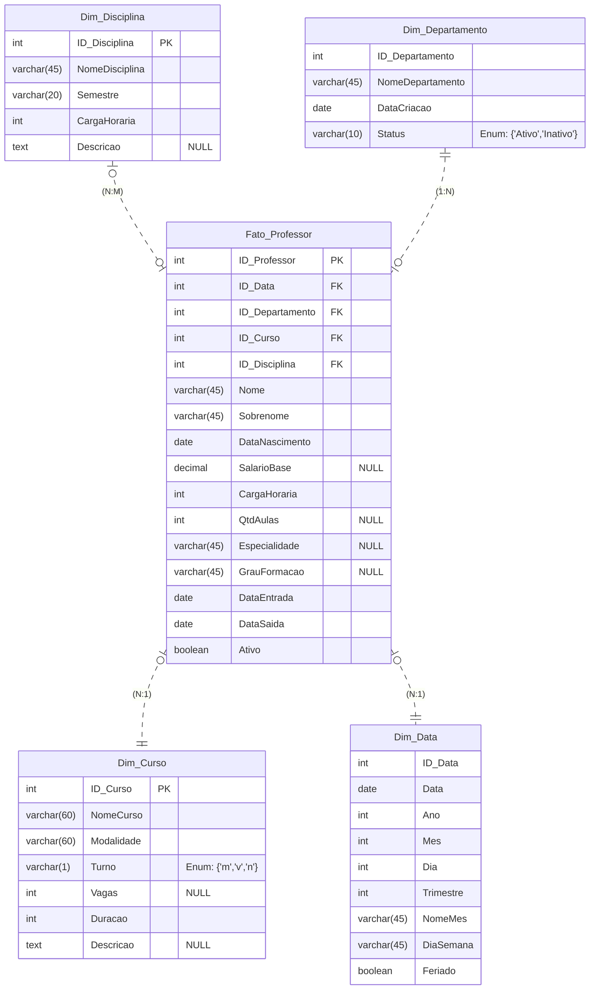

# **Modelagem Dimensional**

  

A **modelagem dimensional** é uma técnica de projeto lógico em banco de dados usada para organizar e otimizar a estrutura dos dados com foco na análise e na criação de relatórios. Essa abordagem agrupa os dados em duas categorias principais:

* **Tabelas Fato**: Armazenam métricas e medidas numéricas.
* **Tabelas de Dimensões**: Fornecem contexto para essas métricas.

 Esse tipo de modelagem facilita a análise de grandes volumes de dados de forma intuitiva e eficiente, permitindo explorar informações de diferentes perspectivas e responder a perguntas de negócio com rapidez e clareza.
 
 
## Estudo de Trajetórias de Professores: Um Modelo Dimensional 

  

O projeto utiliza a modelagem dimensional **Star Schema** para desnormalizar os dados com o objetivo de fornecer uma estrutura de dados para armazenar e analisar informações de entrada e saída dos professores, permitindo a criação de relatórios e insights sobre a trajetória dos professores na instituição. Veja as principais vantagens da aplicação desta modelagem:

* **Simplificação em Consultas SQL**: A modelagem Star Schema auxilia nas consultas SQL, reduzindo a necessidade de  múltiplos "joins" para mesclar dados como acontece no modelo relacional. As chaves estrangeiras das tabelas **dimensões** na tabela **fato** simplifica este processo.

Além disso, o Star Schema facilita a análise preditiva de dados, possibilitando:

* **Futuras Aplicações em Séries Temporais**: O Star Schema facilita futuras aplicações em séries temporais, permitindo realizar análises preditivas de tendências como:
    * **Previsão de Rotatividade**: Analisar quando a taxa de saída de professores tende a aumentar.
    * **Análise de Permanência**: Estudar o tempo médio de permanência dos professores na instituição.
* **Alinhamento com Ferramentas de BI**: A modelagem Star Schema se alinha bem com ferramentas de BI como Power BI e Tableu, permitindo a criação de relatórios otimizados, desenvolvimento  de medidas e flexibilidade para explorar  métricas a partir de diferentes perspectivas.

### Visão Geral do Projeto 

Este projeto tem como objetivo analisar a trajetória dos professores na instituição, reconhecendo a importância da gestão de dados para a tomada de decisões informadas. Pretendemos identificar padrões e tendências que possam auxiliar em decisões estratégicas, como a retenção de talentos e  a melhoria nas condições de trabalho promovendo um ambiente mais acolhedor e produtivo. Portanto, buscamos contribuir para uma melhor compreensão do capital humano da instituição, promovendo uma gestão mais eficiente e informada. 

## Modelo Relacional: Estruturação dos Dados

  

  
</p

O diagrama relacional do projeto é extremamente importante na modelagem, auxiliando na interpretação dos dados e das cardinalidades, permitindo a compreensão clara das relações entre as diferentes entidades.

A **cardinalidade** indica a relação entre duas tabelas, especificando quantas instâncias de uma tabela podem estar associadas a quantas instâncias de outra tabela.

### Descrição das Cardinalidades: 

|Relacionamento|cardinalidade|Descrição|
|--------------|-------------|---------|
|Departamento e Professor| Um para Muitos| Um departamento pode ter vários professores, mas um professor está associado a apenas um departamento.|
|Departamento e Curso| Um para Muitos| Um departamento pode oferecer vários cursos, enquanto cada curso pertence a apenas um departamento.|
|Professor e Disciplina| Muitos para Muitos| Um professor pode lecionar várias disciplinas, enquanto cada disciplina pode ser ministrada por vários professores.|
|Curso e Disciplina| Muitos para Muitos| Um curso pode ter muitas disciplinas, e uma disciplina pode pertencer a diferentes  cursos.|
| Disciplina e Matriculado| Muitos Para Muitos| Uma disciplina pode ter muitos alunos matriculados, e um aluno pode estar matriculado em várias disciplinas.|
|Disciplina e Disciplina & Curso| Um para Muitos| Cada disciplina pode estar associada a múltiplos registros na tabela Disciplina & Curso, permitindo que ela seja vinculada a diferentes cursos.|
|Disciplina e Pré-Requisito| Muitos para Muitos| Uma disciplina pode ter várias outras disciplinas como pré-requisitos, ao mesmo tempo, uma disciplina pode ser um pré-requisito para várias outras disciplinas.|
|Disciplina e Pré-Requisito da Disciplina| Um para Muitos| Uma disciplina pode ter várias outras disciplinas como pré-requisitos, mas cada pré-requisito se refere a apenas uma disciplina.|
|Curso e Disciplina & Curso | Um para Muitos |  Um curso pode conter várias disciplinas, mas cada disciplina em si pode pertencer a vários cursos.|
| Curso e Aluno| Muitos para Muitos| Um curso pode ter muitos alunos matriculados, e um aluno pode se matricular em vários cursos.|
| Aluno e Matriculado| Um para Muitos| Um aluno pode ser várias matículas, mas cada matrícula se refere a apenas um aluno|

## Transição: Modelo Relacional à Modelo Dimensional 
A transição de modelagem foi a etapa central deste projeto. Nosso objetivo foi garantir que as principais informações fossem corretamente integradas à modelagem dimensional, preservando a integridade e consistência dos dados. Com isso, conseguimos realizar análises valiosas, fornecendo insights mais profundos e estratégicos.
### Motivação para a Transição 

Nossa base de dados passará por processos de análise e geração de relatórios, e a modelagem relacional foi uma abordagem essencial para estruturar e normalizar os dados de forma consistente. No entanto, surgiu a necessidade de uma transição para o modelo dimensional, pois a estrutura em Star Schema oferece a flexibilidade necessária para explorar a base de dados, realizar consultas eficientes, criar medidas e, por fim, otimizar os relatórios gerados na ferramenta Power BI.

### Preparação Para o Modelo Dimensional 

Durante a preparação do modelo dimensional, foram realizados ajustes, como a desnormalização das tabelas e reestruturação de relacionamentos : 

* **Remoção de Tabelas**: As tabelas "Disciplina & Curso", "Pré-requisitos" e "Pré-requisitos das Disciplinas" não mantinham relações diretas com os professores. Portanto, decidimos removê-las do modelo dimensional, pois suas informações seriam irrelevantes para a análise. A exclusão dessas tabelas não afetará a integridade e a consistência dos dados.
* **Alteração nos Relacionamentos**: No modelo relacional, algumas tabelas não mantinham relações com a tabela de professores. No modelo dimensional, todas as tabelas estão agora vinculadas a informações sobre os professores, facilitando nossas consultas e a criação de medidas. Essa abordagem traz um impacto significativo na otimização dos relatórios no Power BI.

### Diagrama Dimensional: 

### Conclusão 

Em resumo, a transição do modelo relacional para o modelo dimensional foi um passo crucial para garantir a integridade e a eficiência dos nossos dados. Ao vincular todas as tabelas a informações sobre os professores, conseguimos otimizar as consultas e a criação de medidas, resultando em relatórios mais eficazes no Power BI. Esse processo não apenas facilita a análise dos dados, mas também potencializa a tomada de decisões informadas, contribuindo para o sucesso de nossas iniciativas acadêmicas.

### Contato 

